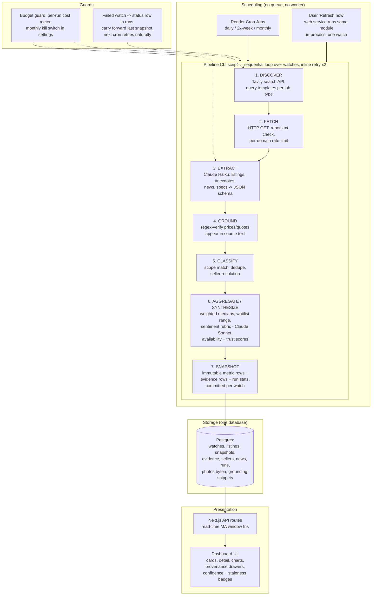

# PRD: Rolex Market-Tracking Dashboard ("Crown Tracker")

**Version:** 3.0 · **Date:** 2026-07-10 · **Owner:** Steve Forte · **Audience:** downstream AI builder implementing end-to-end

**v2 changes (from Steve's review):** asking-price labels made explicit on the dashboard (§5.2.3); seed source universe expanded beyond Chrono24 with named sites and access methods (Appendix A); credentials policy added — accounts for official APIs yes, credentialed page-scraping no (§9); eBay Browse API pulled forward to Phase 2 (§12); open question #3 resolved (§13).

**v3 changes (simplification pass — Steve's directive: optimize every decision for easy to build, run, and maintain; prefer Render and simple tools):** hosting retargeted to **Render**; pg-boss queue and the always-on worker **deleted** — replaced by Render Cron Jobs running the pipeline as a plain CLI script; R2 object storage **deleted** — photos and snippets live in Postgres; Auth.js replaced by a **single env-var password**; Docker made optional (Render builds from GitHub); the v2 hybrid Mac-mini profile **cut from scope** (one-paragraph pattern retained); Tavily locked as the sole search API; seed-config editing UI cut in favor of JSON files in the repo. Full decision-by-decision review in the new **§7.7 Simplification Ledger**. Net result: **the entire system is one Render web service + three Render cron entries + one Postgres database + three external APIs.**

---

## 0. Executive Summary of Recommended Approach

Build a single-user responsive web app with the smallest possible footprint: **one Next.js + TypeScript web service on Render, one Render-managed Postgres as the only datastore, and the refresh pipeline as a plain CLI script (`npm run pipeline -- --tier=daily`) executed by Render Cron Jobs.** No queue, no worker process, no Redis, no object storage, no Docker requirement — deploy is `git push`. All market data is acquired through a **search-API + LLM-extraction pipeline** (Tavily for discovery, plain HTTP fetch for retrieval, Anthropic Claude for structured extraction and synthesis) — **no headless scraping, no proxies** in MVP. Refresh is **tiered**: prices and availability daily, sentiment/news/waitlist twice weekly, specs/photos monthly. Every derived number carries four first-class attributes stored alongside it: **provenance (list of source URLs + quotes), confidence (High/Med/Low from a deterministic formula), sample size, and captured-at timestamp** — the UI never shows a figure without them. 52-week moving averages bootstrap via a one-time provenance-tagged backfill plus a growing window explicitly labeled "partial." Seller trust combines a **curated seed list of known-reputable dealers with LLM-researched scores for the long tail**, plus scam heuristics (price-too-good, jurisdiction risk, payment red flags). Estimated running cost at 25 watches: **$30–50/month** (Render web $7 + Postgres from $6 + cron ~$1–3, search API ~$10–20, LLM ~$5–15).

Locked decisions from scoping: responsive web app; single user, ≤25 watches; simple auth; ≤$50/mo budget; search-API + LLM extraction; waitlist via LLM synthesis of community chatter; tiered cadence; backfill + growing-window MA; hybrid rubric-LLM indices; curated-seed + LLM seller reputation. **v3 overlay: Render hosting, minimum moving parts everywhere (§7.7).**

### 0.1 Phase 1 launch budget guard (added 2026-07-11)

Start with Tavily's free Researcher allowance for local validation. The Phase 1A implementation makes **one Tavily Basic Search per active watch per scheduled daily run**; at the 25-watch limit that is about **750 credits/month**, leaving roughly 250 credits for initial checks and manual testing under the 1,000-credit free allowance. Direct HTTP retrieval of the returned URLs does not consume Tavily credits.

Do **not** enable the §5.2.3 6–10-query template set, automatic historical backfill, or manual refreshes on the free allowance: they would exceed it quickly. Add a named monthly credit cap before enabling those features, then use Pay-As-You-Go or a paid plan deliberately. Tavily documents separate development and production keys; verify the required production-key plan status before enabling the Render cron.

---

## 1. Summary and Problem

Rolex market data is fragmented, unofficial, and adversarial: ADs never publish waitlists, grey-market prices scatter across dozens of platforms in multiple currencies, community sentiment lives in Reddit threads and forums, and a meaningful share of "great deals" are scams. A collector deciding whether to wait for an AD allocation, buy grey, or sell an existing piece must manually synthesize all of this, repeatedly, per reference. Crown Tracker is a personal dashboard that automates that synthesis: the user defines a watch list of Rolex references with precise market-scope parameters, and the system refreshes each entry on a schedule via web research, producing price averages, trend lines, a modeled waitlist estimate, sentiment, availability, vetted buying options, and news — every figure carrying explicit provenance, confidence, and freshness so the user always knows how much to trust it.

---

## 2. Goals and Non-Goals

### 2.1 Goals

1. Track up to 25 user-defined Rolex references, each with a full market-scope definition (condition, unworn/pre-owned, year range, papers, warranty).
2. Automatically refresh market data on a tiered schedule with zero manual intervention; degrade gracefully (stale badges, carried-forward values) rather than fail silently.
3. Surface every dashboard field listed in §5.2, each with provenance links, confidence tier, sample size, and data age.
4. Build a permanent, append-only price history from day one so trend metrics improve with time.
5. Actively protect the user from scam sellers via reputation scoring and deal-anomaly flags.
6. Total running cost ≤ $50/month at full load.

### 2.2 Non-Goals (explicit)

- **Not** a transaction platform: no buying, bidding, escrow, or checkout. Links out only.
- **Not** multi-tenant SaaS: one user. Schema leaves the door open (a `user_id` column exists) but no billing, teams, sharing, or per-user rate isolation is built.
- **Not** an authentication service for watches: no counterfeit detection of physical pieces.
- **Not** a guaranteed-accurate price oracle: outputs are modeled estimates with stated uncertainty, not appraisals.
- **Not** brands beyond Rolex in v1 (schema is brand-agnostic; UI and prompts are Rolex-tuned).
- **No** headless-browser scraping or bot-evasion in MVP (see §9 for policy and the Phase-3 revisit).
- **No** native mobile apps or push notifications in MVP (email alerts arrive Phase 3).

---

## 3. Users, User Stories, Flows

Single persona: a knowledgeable collector ("Steve") who checks the dashboard a few times per week and occasionally deep-dives one reference.

### 3.1 Primary user stories

- **US-1 Add a watch:** As the user, I add a reference (e.g., 126500LN "Panda") with specs and market-scope parameters, and within ~10 minutes the system has run an initial research pass and the card is populated (or shows partial data with clear "gathering" states).
- **US-2 Morning glance:** I open the dashboard and see all watches as cards with current grey price, resell price, 52-wk trend direction, availability, sentiment, and staleness badges — enough to spot movement in under 30 seconds.
- **US-3 Deep dive:** I click a watch and see full detail: price history chart with both moving averages, the waitlist estimate with its evidence, where-to-buy list ranked by trust, news, and every source link.
- **US-4 Trust check:** For any number I can answer "where did this come from and how fresh is it?" in one click (provenance drawer).
- **US-5 Buy safely:** I see purchase options ordered by a transparent trust score, with scam-prone listings visibly flagged rather than hidden.
- **US-6 Tune scope:** I edit a watch's scope (e.g., switch from "unworn only" to "any condition") and the next refresh re-filters listings accordingly; historical aggregates are not retroactively rewritten but the scope change is recorded as an annotation on the chart.
- **US-7 Force refresh:** I press "Refresh now" on one watch and a full pipeline run executes for it within a few minutes, subject to a per-day manual-refresh cap (default 5/day) to protect budget.
- **US-8 Retire a watch:** I archive a watch; refreshes stop, history is retained, and it can be un-archived.

### 3.2 Core flows

**Flow A — Add watch:** Add → type reference number → system does an immediate spec-lookup pass (official specs, photo, retail price) and shows a confirmation card ("Daytona 126500LN, 40mm, White dial — is this right?") → user confirms/edits specs → user sets scope parameters (defaults: any condition, papers required, any year, no warranty requirement) → save → card shows per-field skeleton/"gathering" states until the next scheduled scan or a capped manual refresh lands.

**Flow B — Scheduled refresh:** Render cron fires per tier → pipeline CLI loops over active watches sequentially, committing per watch (§6) → new snapshot rows written → dashboard reflects on next load. No user interaction, no queue.

**Flow C — Provenance drill-down:** Any metric chip → click → drawer showing: value, confidence tier + the three numbers behind it (sample size, source diversity, dispersion), captured-at, list of evidence items (URL, source name, quoted text, retrieved date), and computation note ("median of 14 in-scope listings after IQR outlier removal").

---

## 4. Input Model: Defining a Tracked Watch

A tracked watch = **identity + specs + scope**. Scope is what makes averages meaningful: a 2016 pre-owned no-papers Daytona and a 2025 unworn full-set are different markets.

| Group | Field | Type | Required | Notes |
|---|---|---|---|---|
| Identity | `reference_number` | string | ✔ | e.g., `126500LN`. Primary research key. |
| Identity | `model_name` | string | auto | e.g., "Cosmograph Daytona". Auto-filled, editable. |
| Identity | `nickname` | string | – | e.g., "Panda". Used in search queries as an alias — important, since community chatter uses nicknames more than references. |
| Specs | `case_size_mm` | number | auto | Auto-filled from spec lookup. |
| Specs | `dial` | string | ✔ if reference has variants | e.g., "White (Panda)". Disambiguates references with multiple dials. |
| Specs | `bezel`, `bracelet`, `movement`, `material` | strings | auto | Display + listing-matching hints. |
| Scope | `condition` | enum: `unworn` \| `pre_owned` \| `any` | ✔ | Splits grey vs. resell population (§5.2.3). |
| Scope | `production_year_min/max` | int range | – | Null = any year. Apply only when the year is attached to the individual listing or its detail page; never infer it from collection-page copy. |
| Scope | `papers` | enum: `required` \| `not_required` | ✔ | "Full set" matching. |
| Scope | `box` | enum: `required` \| `not_required` | – | Default not_required. |
| Scope | `warranty` | enum: `factory_remaining` \| `third_party_ok` \| `none_ok` | – | `none_ok` means no warranty requirement (default). `factory_remaining` requires explicit factory-warranty evidence. `third_party_ok` accepts factory or third-party coverage when stated; an absent warranty is unknown, not evidence of no coverage. |
| Meta | `notes` | text | – | Free-form. |
| Meta | `status` | enum: `active` \| `archived` | auto | |

**Scope matching at ingestion (Phase 1B+):** every discovered listing is classified against scope by the extraction LLM into `in_scope` / `out_of_scope` / `uncertain`, with the specific failing attribute recorded. `uncertain` listings (listing doesn't state papers, year, warranty, etc.) are **included in aggregates at 0.5 weight** and counted separately in the provenance drawer ("14 in-scope + 6 uncertain"). *Assumption: half-weighting uncertain listings beats excluding them (starves small samples) or including them fully (pollutes scope). Builder may tune the weight; keep it a named constant.*

**Listing-level evidence rule (Phase 1B+):** a collection/search page is a discovery surface, not a listing record. The pipeline must create one candidate per visible listing row, preserving that row's title, price text, stable SKU when available, and detail URL. A production year, warranty, condition, papers, or box attribute is valid only when it appears in that same row or on that row's robots-permitted detail page. Do not apply a model introduction year, page publication date, dealer-wide warranty, or other page-level copy to every row. If a permitted detail page cannot supply the attribute, store it as `unknown` with the source URL and continue using the named uncertain-listing policy.

**Phase 1A constraint:** until row/detail extraction exists, keep production-year bounds unset and use `none_ok` for warranty. Phase 1A may show a captured asking price, but it must not claim a listing-level year or warranty it cannot ground.

---

## 5. Functional Specification

### 5.1 Dashboard layout

- **List view:** one card per watch — photo, reference + nickname, current grey avg, resell avg, sparkline (12 weeks), availability chip, sentiment chip, worst-staleness badge for the card, confidence dots per number.
- **Detail view:** everything in §5.2 plus full price-history chart (daily points, 52-wk MA lines, scope-change and backfill annotations), where-to-buy table, waitlist evidence panel, news feed, provenance drawers.
- Sort/filter list view by: biggest 7-day mover, availability, staleness.

### 5.2 Dashboard fields — exact computation per field

Conventions used by every derived field:

- **Snapshot:** each pipeline run writes an immutable row per (watch, metric) with value, sample size, confidence inputs, and evidence links. Dashboards always render the latest snapshot; charts render the series.
- **Confidence formula (deterministic, shared):** each metric computes three subscores in [0,1] — `sample` (n vs. metric-specific target n), `diversity` (distinct domains / target domains), `agreement` (1 − normalized dispersion, metric-specific) — and takes the weighted mean (weights 0.4/0.3/0.3). Tiering: ≥0.7 High, ≥0.4 Medium, else Low. All three inputs stored per snapshot so the drawer can show *why* confidence is what it is.
- **Staleness:** every rendered value shows relative age ("6h ago"). A value older than **2× its tier's refresh interval** gets an amber `STALE` badge; older than **4×** gets red `OUTDATED` and the value renders greyed-out. Values are carried forward, never hidden — an old number with a red badge beats a blank.
- **Currency:** all prices normalized to USD at fetch time using a daily ECB/exchangerate.host rate; original currency + amount preserved on each listing row.

#### 5.2.1 Model info, photo, technical specifications

- **Source:** rolex.com official pages (public spec/price pages) via search-API discovery + HTTP fetch + LLM extraction; fallback to reputable databases (WatchBase, watch media) if the reference is discontinued and off rolex.com.
- **Computation:** none — extracted facts. Confidence High when from rolex.com, Medium otherwise.
- **Photo:** official press/product image fetched once and stored as `bytea` in Postgres (v3 — no object storage) with source attribution. Refreshed monthly. If no image can legally be cached, hotlink with attribution and a placeholder fallback.
- **Refresh tier:** monthly (specs don't change; discontinued status can).

#### 5.2.2 AD retail price

- **Source:** rolex.com published list price for the reference (Rolex publishes retail prices publicly). For discontinued references: last known list price, labeled "last MSRP (discontinued YYYY)".
- **Computation:** direct extraction; single-source. Confidence High from rolex.com; the `agreement` subscore is replaced by a sanity check vs. previous snapshot (>10% jump without a known Rolex price-adjustment event → flag for review, keep previous value, mark Medium).
- **Refresh tier:** monthly (Rolex adjusts list prices ~1–2×/year).

#### 5.2.3 Average grey-market price & 5.2.4 Average resell price

Definitions (this distinction drives everything):

- **Grey market** = *unworn/new* watches offered by non-AD dealers (the "premium over retail for skipping the waitlist" market).
- **Resell** = *pre-owned* watches on the secondary market (dealers and platforms).

Computation (identical machinery, different condition filter):

1. Discovery: per watch, run a fixed query template set against the search API (~6–10 queries: `"{ref}" price`, `"{ref}" "{nickname}" for sale`, plus site-scoped queries against the seed source universe in **Appendix A** — Bob's Watches, SwissWatchExpo, Luxury Bazaar, The 1916 Company, Crown & Caliber, Grailzee completed auctions, StockX, etc.).
2. Fetch result pages (HTTP GET, robots.txt-respecting, §9). For collection pages, extract **each visible listing row** and its detail URL. Fetch a detail URL only when it is robots-permitted and required to ground a row-level attribute such as production year or warranty.
3. LLM extracts every individual listing: price, currency, condition, year, papers, box, warranty, seller name, stable SKU when available, row URL, and detail URL. Each attribute retains the URL and short grounding snippet that supports it.
4. Grounding check (anti-hallucination): each extracted price must appear verbatim in its own row or detail page (post currency-symbol normalization), verified by regex. Production year and warranty receive the same row/detail-level provenance check. Rows failing their price grounding are dropped and logged; unsupported optional attributes are `unknown`.
5. Dedupe by stable seller listing identity: `seller_domain + SKU` when present, otherwise canonical detail URL, otherwise a hash of the normalized row title and source URL. Listings seen in prior runs are re-observed, not duplicated.
6. Scope-classify (§4), split by condition into grey vs. resell populations.
7. Aggregate: **weighted median** (weights: 1.0 in-scope, 0.5 uncertain) after IQR outlier removal (drop outside Q1−1.5·IQR / Q3+1.5·IQR). Median, not mean — scam listings and delusional asks make the tails garbage.
8. Also stored per run: n, IQR, min/max retained, count of outliers dropped.
- **Confidence targets:** n target = 8 listings, diversity target = 4 domains, agreement = 1 − (IQR/median, capped at 1).
- **Displayed as:** dashboard labels are explicitly **"Avg asking (grey)"** and **"Avg asking (resell)"** — e.g., "Avg asking (grey): $34,800 · n=14 · High confidence · 6h ago" with drawer. *(Decision, v2: asking prices accepted as the basis; the label carries the honesty.)*
- **Refresh tier:** daily.
- **Transaction-price signal (secondary):** where sold data is publicly published — Grailzee's completed-auctions pages, StockX last-sale data, auction-house results (Appendix A) — those observations are ingested with `price_basis='sold'` and shown as a separate "recent sold" line in the drawer, not blended into the asking average. eBay sold data via official API strengthens this in later phases (§12).

#### 5.2.5 & 5.2.6 52-week moving averages (grey and resell)

- **Computation:** simple moving average over the trailing 365 days of daily snapshot medians, computed at read time via SQL window function (no precomputed table at this scale). Days with no snapshot are skipped (average over available points), and the point count is stored.
- **Bootstrap (before 52 weeks of own data exist):** see §10. Short version: one-time backfill of weekly historical points per watch from public historical-chart pages, every backfilled row tagged `provenance='backfill'`; until own-data coverage reaches 52 weeks, the UI labels the metric with its true window — "**28-wk avg (partial)**" — and the chart shades the backfilled region. A 52-wk number is never displayed unless 52 weeks of data actually underlie it.
- **Confidence:** inherits the median confidence of underlying points; backfilled points count at 0.5 toward the `sample` subscore.

#### 5.2.7 Estimated AD waitlist length (modeled)

This is the most-inferred field in the product; the UI treats it accordingly (always shown as a range, never a point; drawer opens on the evidence by default).

- **Discovery:** 2×/week, search Reddit (r/rolex, r/watchexchange discussion), watch forums (Rolex Forums, WatchUSeek), and YouTube/community posts for `"{ref}" waitlist`, `"{model_name}" wait time AD`, nickname variants.
- **Extraction:** LLM extracts *dated anecdotes*: reported wait (months), report date, region if stated, purchase-history context if stated ("first Rolex" vs. "established client"), URL + quote. Each anecdote is an evidence row.
- **Synthesis:** anecdotes from the trailing 12 months, recency-weighted (half-life 90 days), produce a **range = weighted 25th–75th percentile** of reported waits, e.g., "≈ 12–36 months". A one-line LLM-written qualifier is stored with citations (e.g., "established clients report shorter waits; boutique vs. AD varies").
- **Confidence targets:** n target = 6 anecdotes, diversity 3 domains, agreement = 1 − (range width / range midpoint, capped). With < 3 anecdotes in 12 months: display "**Insufficient chatter to estimate**" — never fabricate.
- **Display:** "Est. waitlist: 12–36 months · Low confidence · modeled from 7 community reports" — the phrase *modeled estimate* always visible.

#### 5.2.8 Market sentiment ("vibe")

- **Method (hybrid, per scoping decision):** LLM scores community text against a **fixed rubric**, grounded in quotes; a quantitative price-trend signal is displayed alongside but *not* blended into the sentiment score (keeps "what the community feels" separable from "what the price does").
- **Rubric:** score −2…+2 on three dimensions — desirability trajectory (is the community more or less excited than ~3 months ago), criticism intensity (recurring negatives: movement issues, size complaints, "played out"), hype vs. fatigue. Overall = mean of dimensions. LLM runs at temperature 0, must return ≥3 supporting quotes with URLs; a response without grounded quotes is rejected and retried once, then the run is marked failed (carry forward previous score).
- **Smoothing:** displayed score = EWMA (α = 0.3) over run scores, damping run-to-run LLM drift.
- **Display:** label (Very negative / Cooling / Neutral / Warm / Hyped) + one-line rationale + quote drawer. Refresh 2×/week.
- **Confidence:** n target = 10 source texts, diversity 3 domains, agreement = 1 − stddev of the three dimension scores /2.

#### 5.2.9 Availability index (High / Medium / Low)

- **Method (mostly quantitative, per scoping decision):** composite score in [0,1]:
  - 50% — in-scope listing count this run, normalized against the watch's own trailing 8-week average count (relative, so a naturally rare reference isn't permanently "Low" by absolute count… but see floor rule below);
  - 25% — 4-week trend of listing counts (rising supply → higher availability);
  - 25% — waitlist-pressure inverse (long waitlist estimate → grey demand pressure → effectively lower availability), omitted and renormalized when waitlist confidence is Low.
  - **Floor rule:** absolute in-scope count < 3 forces `Low` regardless of relative score.
- **Tiers:** ≥0.66 High, ≥0.33 Medium, else Low. Raw score + components stored; drawer shows the breakdown.

#### 5.2.10 Where to buy — locations, links, trust scores

- **Population:** de-duplicated sellers from current in-scope listings, ordered by trust score descending; each row = seller name, jurisdiction, platform, current price, link, trust badge, flags.
- **Trust score (0–100), per scoping decision — curated seed + LLM long tail:**
  - **Curated seed list** ships with the product (~30 entries: Chrono24 as platform, The 1916 Company, Bob's Watches, Watchfinder, Crown & Caliber, Hodinkee Shop, European Watch Co., major regional ADs' pre-owned programs, etc.) with hand-set scores 80–95 and `curated=true`. Builder ships the list as a JSON file in the repo loaded by migration (v3 — no settings UI); Steve edits scores or adds entries by editing the file and pushing.
  - **Unknown sellers:** LLM research pass (monthly per seller, cached) scoring: community consensus mentions (Reddit/forum searches for "{seller} legit/scam/review"), years in operation, physical presence, return policy/escrow, platform buyer protection. Output 0–100 + rationale + evidence rows, always rendered with an "inferred" badge to distinguish from curated.
  - **Jurisdiction modifier:** configurable risk table (seed defaults flag jurisdictions with weak buyer recourse for high-value goods); applies up to −15.
  - **Deal-anomaly flag (independent of seller score):** listing price < 80% of current in-scope median → ⚠ "priced well below market — classic scam signal" regardless of seller. Payment red flags extracted from listing text (wire-only, crypto-only, off-platform contact) add flags.
- **Display buckets:** 80–100 Trusted · 50–79 Caution · <50 High risk (shown collapsed under a warning, never silently hidden — the user asked to see the risky long tail, flagged).

#### 5.2.11 Recent news on the reference

- 2×/week news-vertical search (`"{ref}" OR "{model_name} {nickname}" Rolex` limited to trailing 30 days); LLM filters to items genuinely about the reference or directly affecting it (discontinuation rumors, price changes, releases displacing it) and writes a one-line summary each. Deduped by URL + fuzzy title. Display: latest 5, with date, source, link. Empty state: "No reference-specific news in the last 30 days" (normal for most references, not an error).

#### 5.2.12 Source links throughout

Every derived value links to its evidence rows (URL, domain, quote, retrieved-at). Evidence is stored permanently (append-only) — snapshots must remain auditable even after source pages die. Quotes are capped at 300 chars (fair-use posture, §9).

---

## 6. End-to-End Data Flow

Ingestion → enrichment/estimation → storage → scheduled refresh → presentation:



Key properties: the pipeline **commits per watch** (a crash mid-run loses at most one watch's refresh, and the next cron run is the retry mechanism); one watch failing cannot block others (per-watch try/catch); cron containers run to completion independent of web-service deploys; everything is idempotent — re-running a tier the same day adds snapshots and dedupes listings, corrupting nothing.

**Job types and tiers:**

| Job type | Cadence | Produces |
|---|---|---|
| `price_scan` | daily 06:00 UTC | grey/resell listings → price snapshots, availability inputs, where-to-buy rows |
| `chatter_scan` | Mon & Thu | waitlist anecdotes, sentiment score |
| `news_scan` | Mon & Thu | news items |
| `spec_refresh` | monthly | specs, photo, retail price, discontinued status |
| `seller_research` | monthly per unknown seller | trust scores |
| `initial_research` | on watch creation | all of the above + historical backfill |

---

## 7. Recommended Technical Architecture

Principle at this scale (1 user, ≤25 watches, ~40 pipeline executions/day): **one repo, one web service, one database, and cron — nothing else.** Every additional moving part must justify itself; in v3, none did. The complexity budget is spent where it earns its keep — provenance, confidence, and anti-scam logic — and stripped from infrastructure, where it doesn't.

| Concern | Recommendation | Reasoning | Credible alternative |
|---|---|---|---|
| App framework | **Next.js 15 (App Router) + TypeScript**, Tailwind + shadcn/ui, Recharts for charts | One codebase for UI + API; the AI-builder ecosystem/tooling is strongest here; SSR fits a data dashboard | SvelteKit — lighter, equally capable; choose it only if the builder is more fluent in it |
| Database | **Postgres 16** (Render-managed) | Relational fits the schema; window functions do the MAs; JSONB absorbs raw extraction payloads; photos and snippets live here too — one backup story for literally everything | SQLite + Litestream if ever self-hosting — fine at this scale, but managed Postgres removes the ops |
| Jobs/scheduling | **Render Cron Jobs** running the pipeline as a plain CLI script (`npm run pipeline -- --tier=daily`); three cron entries (daily / 2×-week / monthly); no queue, no worker | The pipeline is just a Node script an AI builder can write and test locally in one command; cron containers spin up, run to completion, exit (~$1–3/mo, billed per second); retries = inline ×2 + next scheduled run; "queue state" = the `runs` table | node-cron inside the web service via Next `instrumentation.ts` — one fewer Render entry, but couples refresh timing to web-deploy restarts; pg-boss only if this ever goes multi-user |
| Search/discovery | **Tavily API only** (v3 decision — one search vendor, one bill, one client) (~$0.005–0.008/query, ≈$15/mo at this load) | Built for LLM pipelines: returns cleaned page content with results, often eliminating the fetch step | SerpAPI swapped in behind the same interface *only if* Phase-2 measurement shows Tavily's Reddit/forum coverage is inadequate — do not run two vendors speculatively |
| LLM | **Anthropic API: Claude Haiku** for extraction/classification (high volume, JSON-schema output), **Claude Sonnet** for synthesis (sentiment rubric, waitlist synthesis, seller research) | Two-tier keeps cost ~$5–15/mo; extraction is volume work, synthesis is judgment work | OpenAI gpt-4.1-mini / gpt-4.1 split, same pattern. **Genuine judgment call — model quality shifts quarterly; builder should make the provider a config-level swap** |
| Fetching | Plain `fetch` + per-domain token-bucket rate limiter, robots.txt check, honest User-Agent; **no raw-HTML cache** — store only the ~2KB grounding snippet per extracted listing (in Postgres) | Policy: no headless browsers, no proxy rotation (§9). Tradeoff accepted (v3): improved prompts can't be re-run against old pages — at 25 watches, re-fetching is cheap enough not to matter | Keep a 14-day compressed HTML cache in Postgres if the builder finds re-extraction valuable during development |
| Object storage | **None (v3)** — photos stored as `bytea` in Postgres (25 watches × ~500KB ≈ 12MB), served via a route handler | One less account, credential, and backup story; the data is tiny | R2/S3 if photo volume ever grows 100× |
| Auth | **Single password in an env var** + signed httpOnly session cookie (~20 lines of middleware) | Zero dependencies, no email service needed until Phase 3, nothing to maintain; this is a one-person tool behind TLS | Auth.js magic-link when/if a second user ever appears |
| Hosting | **Render**: 1 web service ($7) + 1 Postgres (from $6) + 3 cron entries (~$1–3), ≈ **$14–16/mo**; native GitHub build, no Docker required | Steve's preference; cron jobs as first-class services is exactly the v3 execution model; long-running jobs fine (the pipeline's multi-minute runs rule out serverless-functions-only platforms) | Railway (near-equivalent); Mac mini all-local (pattern note in §7.6) |
| FX rates | exchangerate.host or ECB daily feed | Free, daily granularity is enough | — |
| Email (Phase 3) | Resend | Trivial API, free tier | — |

**Infrastructure inventory (complete):** 1 GitHub repo → 1 Render web service + 3 Render cron entries + 1 Render Postgres. External accounts: Tavily, Anthropic, FX-rate feed (keyless). That is the entire system.

**Highest-stakes choices, restated with alternatives (per brief):**

1. **Search-API + LLM extraction vs. headless scraping** (chosen: former). Consequence accepted: coverage of listings behind aggressive bot walls (notably Chrono24 detail pages) is partial — the pipeline sees what search indexes and fetchable pages expose. Alternative: Playwright + residential proxies raises coverage ~20–30% at roughly +$50–100/mo, high fragility, and knowing ToS breach. Revisit at Phase 3 only if price confidence is chronically Low.
2. **Postgres-everything vs. specialized stores** (chosen: former). A time-series DB (Timescale) or vector store adds nothing at 25 watches × 365 rows/year.
3. **LLM provider** — see table; make it swappable, don't marry it.

### 7.6 Deployment (v3: one profile)

**Render, all-in, built from GitHub — no Docker required.** The repo needs exactly one piece of deploy configuration: a `render.yaml` blueprint declaring the web service, the Postgres instance, and three cron entries (`--tier=daily` at 06:00 UTC, `--tier=chatter` Mon/Thu, `--tier=monthly` on the 1st). Deploy = `git push`. Backups: Render Postgres includes automated daily backups on paid tiers — verify retention on the chosen tier and add a weekly `pg_dump` to the repo's GitHub-Actions artifacts if more is wanted (one 10-line workflow).

The v2 hybrid Mac-mini profile is **cut from v3 scope** as complexity that wasn't paying rent (savings ~$5–10/mo against a real ops burden: a second machine to patch, monitor, and keep awake). If pipeline compute ever genuinely outgrows a $7 instance, the pattern remains one paragraph: run the same pipeline CLI on the mini via launchd/cron with `DATABASE_URL` pointing at Render Postgres over TLS — the shared database is the synchronization, nothing to build. Do not build this preemptively.

### 7.7 Simplification Ledger (v3) — every decision reviewed

| Decision | v2 | v3 | Why |
|---|---|---|---|
| Hosting | Railway | **Render** | Steve's preference; equivalent capability, first-class cron jobs fit the new execution model |
| Job execution | pg-boss queue + always-on worker | **CLI script + Render Cron** | Deletes a library, a process, and a concept; a plain script is the easiest artifact to build, test locally, and debug |
| Retry/dead-letter | pg-boss retry ×3 → DLQ | **Inline try/catch ×2 + next cron run; failures = rows in `runs`** | The next scheduled run *is* the retry queue at this cadence |
| Object storage | Cloudflare R2 | **Cut — Postgres bytea for photos, snippets for grounding** | One less vendor/credential/backup; data measured in MB |
| Raw HTML cache | 30 days in R2 | **Cut — keep 2KB grounding snippet per listing** | Re-fetching is cheaper than maintaining a cache layer; snippet preserves auditability |
| Auth | Auth.js magic link | **Env-var password + session cookie** | Removes the email dependency from Phase 0 entirely |
| Search vendor | Tavily + possible SerpAPI split | **Tavily only, swap-not-add policy** | One client, one bill; measurement gates any change |
| LLM | Two-tier Haiku/Sonnet, swappable provider | **Kept** — config, not infrastructure | Cost/quality split earns its keep; zero moving parts |
| Framework / DB / charts | Next.js, Postgres, Recharts | **Kept** | Already the simple choice |
| Docker Compose | Required from day one | **Optional dev convenience** | Render builds from GitHub; Compose only aids local Postgres |
| Hybrid mini profile | Specified (Profile B) | **Cut; one-paragraph pattern retained (§7.6)** | Ops burden > savings; trivially recoverable later |
| Seed-config editing UI (sellers, jurisdictions, settings) | Settings screens | **JSON files in repo, edit + push** | For one technical user, a settings UI is pure build cost; `settings` table keeps only runtime state (budget meter, refresh quota) |
| Tiered cadence, confidence formula, provenance/evidence model, append-only history, anti-scam logic | — | **Kept unchanged** | This is essential complexity — the product *is* this logic; stripping it would simplify the wrong thing |
| Email alerts, PWA, golden-set harness | Phase 3 | **Kept in Phase 3** | Already deferred |

---

## 8. Data Model / Key Schemas

Postgres DDL sketch (builder finalizes types/indexes; append-only tables noted):

```sql
users (id, email, created_at)  -- single row in practice

watches (
  id uuid PK, user_id FK, reference_number text, model_name text, nickname text,
  specs jsonb,          -- {case_size_mm, dial, bezel, bracelet, movement, material}
  scope jsonb,          -- {condition, year_min, year_max, papers, box, warranty}
  photo bytea, photo_mime text, photo_source_url text,   -- v3: no object storage
  retail_price_usd numeric, discontinued bool, status text, created_at, updated_at
)

runs (  -- one row per pipeline job execution
  id uuid PK, watch_id FK NULL, job_type text, started_at, finished_at,
  status text,          -- succeeded | partial | failed
  queries_used int, tokens_in int, tokens_out int, est_cost_usd numeric,
  error jsonb
)

listings (  -- append-only observations
  id uuid PK, watch_id FK, run_id FK, seller_id FK,
  url text, price_original numeric, currency text, price_usd numeric, fx_rate numeric,
  condition text, year int, papers bool, box bool, warranty text,
  price_basis text,     -- asking | sold  (sold = published transaction/auction result)
  scope_match text,     -- in_scope | out_of_scope | uncertain
  scope_fail_reason text, dedupe_hash text, first_seen_at, observed_at,
  anomaly_flags text[], -- e.g. {price_too_low, wire_only}
  grounding_snippet text CHECK (length(grounding_snippet) <= 2048)  -- v3: replaces raw-HTML cache
)

metric_snapshots (  -- append-only; one row per (watch, metric, run)
  id uuid PK, watch_id FK, run_id FK, metric text,
    -- grey_avg | resell_avg | retail | waitlist_est | sentiment | availability
  value numeric NULL, value_low numeric NULL, value_high numeric NULL,
  label text NULL,      -- e.g. sentiment label, availability tier
  n int, n_uncertain int, outliers_dropped int,
  conf_sample real, conf_diversity real, conf_agreement real,
  confidence text,      -- high | medium | low | insufficient
  provenance text,      -- live | backfill | carried_forward
  computed_at timestamptz
)
-- 52-wk MA computed at read time:
--   AVG(value) OVER (PARTITION BY watch_id, metric ORDER BY computed_at
--                    RANGE BETWEEN INTERVAL '365 days' PRECEDING AND CURRENT ROW)

evidence (  -- append-only; provenance for everything
  id uuid PK, run_id FK, watch_id FK,
  attached_to text, attached_id uuid,   -- snapshot | listing | seller | news
  url text, domain text, quote text CHECK (length(quote) <= 300),
  source_type text,    -- listing_page | reddit | forum | news | official
  anecdote jsonb NULL, -- waitlist: {reported_months, report_date, region, context}
  retrieved_at timestamptz
)

sellers (
  id uuid PK, name text, domain text, platform text, jurisdiction text,
  trust_score int, trust_rationale text, curated bool,
  jurisdiction_modifier int, last_researched_at, evidence via evidence table
)

news_items (id, watch_id FK, run_id FK, title, url, source, published_at, summary,
            dedupe_hash)

scope_changes (id, watch_id FK, changed_at, old_scope jsonb, new_scope jsonb)
  -- rendered as chart annotations

settings (key, value jsonb)  -- v3: runtime state only (budget meter, manual-refresh
                             -- quota counter). Curated sellers, jurisdiction table,
                             -- cadence config = JSON files in repo (§7.7)
```

Retention: **everything append-only, kept indefinitely** — at this scale total data is tens of MB/year; history is the product's compounding asset. Nothing to expire (v3: no cache layer exists).

---

## 9. Scraping, Rate Limits, Legal/ToS, Anti-Scam

**Acquisition policy (bright lines for the builder):**

1. Respect robots.txt; cache and re-check weekly per domain.
2. No headless browsers, no CAPTCHA solving, no proxy rotation, no auth-walled content. If a site blocks plain fetches, rely on what the search API surfaces from it, or drop it as a source. Blocked domains get logged with a coverage note surfaced on a simple /status page ("Chrono24 detail pages unavailable — prices from other sources").
3. Per-domain token bucket: ≤1 request / 5s / domain, jittered; global concurrency ≤4; honest User-Agent string.
4. Prefer official APIs where they exist and fit the free/cheap tier: **Reddit API** (chatter), **eBay Browse API** (resell listings — Phase 2), **eBay Marketplace Insights API** (sold prices — Phase 3, requires eBay approval; builder applies early).
4a. **Credentials policy (v2):** creating accounts to obtain **official API keys** (eBay developer account, Reddit app registration) is in-bounds and encouraged. Using a username/password to **log into a site and scrape member-only pages is out-of-bounds** — nearly every marketplace ToS prohibits automated access to authenticated areas, and login walls are an explicit signal the operator doesn't consent. Rule of thumb for the builder: credentials for APIs, never for pages. If a valuable source offers no API and gates data behind login, log it as a coverage gap and surface it to Steve rather than working around it.
5. Stored quotes ≤300 chars with attribution and link (fair-use posture); photos preferentially from official press assets with source recorded.
6. Single-user personal research tool, data never republished — materially lower legal exposure than a commercial aggregator. *Not legal advice; if this ever becomes multi-user/commercial (§2.2), the acquisition posture must be re-reviewed first — flagged as a hard gate, not a nice-to-have.*

**Anti-scam logic (summary of §5.2.10):** curated trust list → LLM-researched long tail (always marked inferred) → jurisdiction modifiers → per-listing anomaly flags (price <80% of in-scope median; wire/crypto-only; off-platform contact push). High-risk rows collapsed behind a warning, never hidden. Trust scores are advisory and the UI's footer says so.

---

## 10. Bootstrapping History-Dependent Metrics

Problem: 52-wk MAs need a year of history that doesn't exist on day one.

1. **One-time backfill (part of `initial_research`):** discover public historical-price-chart pages for the reference (WatchCharts public pages, watch-media "price history" articles); LLM extracts weekly (price, date) points for the trailing 52 weeks where available. Every point → `metric_snapshots` row with `provenance='backfill'`, confidence capped at Medium, evidence attached. Backfill failure is normal and non-fatal (rare references) — the watch simply starts in growing-window mode.
2. **Growing window with honest labels:** MA is computed over whatever exists and labeled with its true window: "12-wk avg (partial)". The string "52-wk avg" appears only when 52 weeks of underlying data exist. No extrapolation, no synthetic fill.
3. **Chart transparency:** backfilled region shaded differently with a legend note ("historical estimate, third-party"); the live/backfill boundary is visually explicit.
4. **Convergence:** backfilled points age out of the trailing window naturally; after 52 weeks of operation the MA is 100% own-observation. Same pattern applies to the availability index's 8-week baseline (uses growing baseline until 8 weeks accrue) and sentiment's EWMA (seeds from first run).

---

## 11. Failure Modes, Edge Cases, Missing/Low-Confidence Data

| # | Failure / edge | Handling |
|---|---|---|
| 1 | Search returns few/no results (rare reference) | Auto-widen queries once (drop scope terms, add nickname/aliases); if still n<3, snapshot `confidence='insufficient'`, UI shows "Not enough market data" — never a fabricated number |
| 2 | LLM extraction hallucination | Grounding regex check (§5.2.3 step 3) drops unverifiable rows; drop-rate per run is logged; >30% drop-rate marks the run `partial` for prompt review |
| 3 | Wild price outliers / scam asks | IQR filter + median aggregation; dropped-outlier count stored and shown in drawer |
| 4 | Reference ambiguity (one ref, many dials) | Dial is a required spec when variants exist (§4); listings with mismatched/unstated dial → `uncertain` at 0.5 weight |
| 5 | Same listing on multiple platforms | Dedupe hash (§5.2.3 step 4); cross-platform duplicates collapse to one observation, all URLs kept as evidence |
| 6 | Source page dies after capture | Evidence rows are permanent; provenance drawer marks link-rot ("source offline, quote preserved") via monthly link check on evidence for latest snapshots |
| 7 | Search/LLM API outage | Inline retry ×2 with backoff per watch; watch marked `failed` in `runs` and the next cron run is the retry; dashboard carries forward last snapshot with staleness badges (§5.2 conventions); status banner if all of yesterday's runs failed |
| 8 | Cost overrun | Per-run cost meter (`runs` table); monthly budget cap in settings — at 80% a dashboard banner warns (email arrives Phase 3), at 100% pause all non-manual runs (kill switch); manual refresh capped 5/day |
| 9 | Rolex price change / new model displacing a tracked ref | Retail sanity check (§5.2.2) + news scan naturally captures it |
| 10 | Scope edit mid-history | Aggregates never rewritten retroactively; `scope_changes` row → chart annotation ("scope changed here") |
| 11 | Currency/FX gaps | Fetch-time USD normalization with stored rate; FX feed down → previous day's rate, flagged in run log |
| 12 | Sentiment quote-grounding failure | Reject + one retry → carry forward previous EWMA, run marked failed |
| 13 | Watch archived / deleted source domain in curated list | Archive stops the pipeline including the watch, keeps history; curated sellers get `last_reviewed` and are deactivated by editing the seed JSON |
| 14 | Duplicate watch (same ref, different scope) | Allowed and useful (e.g., full-set vs. no-papers markets); UI warns it doubles that reference's API spend |

**Global rule for missing/low-confidence data:** show the state honestly (insufficient / stale / carried-forward / partial-window) rather than hiding the field or inventing a value. Every degraded state has a defined visual (grey value + badge) and a drawer explanation.

---

## 12. Phased Build Plan

**Phase 0 — Skeleton (builder-days ~1–3, shorter in v3):** repo with `render.yaml` blueprint, Next.js + Postgres wiring, pipeline CLI entrypoint (`npm run pipeline`) that logs and exits, env-var password auth (~20 lines), watch CRUD with spec-lookup-and-confirm flow (Flow A minus pipeline), seed JSON files (curated sellers, jurisdictions) loaded by migration. *Exit: deployed on Render via git push; can add a watch and see a card with specs/photo/retail from the spec-lookup pass.*

**Phase 1A — listing foundation (implemented):** one Basic Tavily search per active watch per daily run, constrained with Tavily's curated-domain filter; retrieve only returned pages on curated domains after a `robots.txt` check; accept only structured Product/Offer prices; persist listing observations and daily snapshots; display a scope-matched USD asking-price range, median, source link, and captured date. It does not yet reliably extract individual collection-page rows or detail-page attributes, so production-year bounds must remain unset and warranty must remain `none_ok`. This intentionally does **not** use an LLM, currency conversion, or backfill; a manual refresh uses the same capped, one-query policy. It is the credit-safe validation release described in §0.1.

**Phase 1B — MVP pricing quality (~1–2 weeks after Phase 1A evidence):** expand `price_scan` to the §5.2.3 template set only after setting a paid credit cap; enable it only with the explicit Phase 1B capability flag plus `TAVILY_MONTHLY_CREDIT_CAP` and `ANTHROPIC_API_KEY`; implement listing-row extraction and robots-permitted detail-page enrichment before enforcing production-year or warranty scope; add grounded extraction/classification, grey + resell medians, confidence/staleness/provenance UI, availability index, curated-seller where-to-buy, live-history partial-window MAs, and apply the same safeguards to the capped manual refresh. *Exit: the dashboard answers "what's this watch worth today and where can I safely buy it" with honest confidence labels.*

**Release-cycle deferral (2026-07-12):** third-party historical-price backfill is deferred one release cycle while Steve evaluates WatchCharts licensing and alternative sources. Phase 1B ships live-history partial moving averages only; it must not scrape or persist third-party historical data until a source and retention terms are approved.

**Phase 2 — Judgment layer (~1 week):** `chatter_scan` (waitlist estimate + sentiment with rubric/EWMA), `news_scan`, LLM long-tail seller research, evidence drawers everywhere, sort/filter, scope-change annotations. *Exit: every §5.2 field live.*

**Phase 2 also includes (v2):** eBay Browse API integration for resell-listing breadth, and ingestion of published sold prices (Grailzee completed auctions, StockX last-sale) as the separate `sold` price basis (§5.2.3).

**Phase 3 — Hardening & reach (ongoing, prioritized by observed pain):** eBay Marketplace Insights API for sold-price depth (pending eBay approval — apply during Phase 2), email alerts via Resend (price threshold, staleness, budget), PWA installability, link-rot checker, prompt-regression test harness (golden set of cached pages with expected extractions — run on every prompt change), coverage report per source domain, *only if needed:* headless-fetch reconsideration with explicit ToS review, or the Mac-mini pipeline pattern (§7.6) if compute outgrows a $7 instance.

---

## 13. Open Questions & Risks for the Builder

1. **Chrono24 coverage gap** (biggest data risk): decide empirically in Phase 1 how much price signal arrives via search-API snippets and fetchable aggregator pages; if grey-price confidence sits at Low for popular refs, escalate to Steve with the measured gap before touching headless options.
2. **Search coverage (v3: swap, don't add):** Tavily is the sole vendor; in Phase 2, measure whether its Reddit/forum coverage suffices for chatter. If not, swap SerpAPI in behind the single search interface for chatter scans — never run two vendors speculatively.
3. ~~Sold vs. asking prices~~ **Resolved (v2):** asking prices accepted as the primary basis; dashboard labels read "Avg asking (grey/resell)"; published sold data ingested as a separate `sold` series from Phase 2.
4. **WatchCharts ToS for backfill:** the one-time backfill reads public chart pages; if their robots.txt disallows, fall back to watch-media price-history articles — builder must check at implementation time, per §9 policy.
5. **Rolex reference spec source of record:** rolex.com drops discontinued models; pick and document one fallback spec database in Phase 0.
6. **LLM cost drift:** token prices and model quality change quarterly; the two-tier model split and the provider-swap config (§7) are the hedge — builder should log per-run token spend from day one (schema supports it).
7. **Prompt drift / extraction regressions:** mitigated by the Phase-3 golden-set harness; until then, the grounding check and drop-rate alarm are the guardrails.
8. **Jurisdiction risk table contents:** seed defaults are the builder's judgment call flagged for Steve's review — in v3 this lives as a JSON file in the repo (§7.7), so "user-editable" means Steve edits the file and pushes; the builder should keep it well-commented for that reason.

---

## 14. Brief-Coverage Verification

Every dashboard field from the brief, mapped: model info/photo/specs §5.2.1 · AD waitlist estimate with confidence §5.2.7 · AD retail price §5.2.2 · avg grey price §5.2.3 · 52-wk grey MA §5.2.5 · avg resell price §5.2.4 · 52-wk resell MA §5.2.6 · sentiment/vibe §5.2.8 · availability index §5.2.9 · where-to-buy with reliability scoring incl. scam-prone-vs-reputable distinction §5.2.10 · recent news §5.2.11 · source links throughout §5.2.12. Every decision area: platform/scale/auth/budget (§0, §7) · data acquisition incl. bot-blocked sites (§7, §9 line 2) · waitlist sourcing (§5.2.7) · 52-wk bootstrap (§10) · sentiment/availability/reputation definitions (§5.2.8–10) · cadence & cost tradeoffs (§6 table, §11 #8) · build-vs-buy (§7 table) · storage & retention (§8) · provenance/confidence/staleness as first-class (§5.2 conventions, schema) · legal/ToS/anti-scam (§9) · failure modes (§11) · phased plan (§12) · open questions (§13). v3 simplification directive: every decision reviewed and dispositioned in the ledger (§7.7); Render as hosting preference honored (§7, §7.6).

---

## Appendix A — Seed Source Universe (v2)

Candidate sources beyond Chrono24 for price discovery, grouped by role. Ship this as a JSON config file in the repo (v3), not hard-code. **Builder must validate robots.txt + ToS per domain at implementation time (§9 policy)** — this list asserts each site publishes relevant prices publicly, not that fetching is pre-cleared. Curated-trust-list membership (§5.2.10) overlaps but is a separate concern.

| Source | Role | Price basis | Access method | Notes |
|---|---|---|---|---|
| Bob's Watches | Resell (pre-owned) | Asking | Public pages + search API | Also publishes a public used-Rolex price guide — useful cross-check and backfill input |
| SwissWatchExpo | Resell | Asking | Public pages + search API | Large Rolex inventory, clean listing pages |
| Luxury Bazaar | Resell + grey (unworn) | Asking | Public pages + search API | Carries unworn stock — feeds both populations; condition field critical |
| The 1916 Company (ex-WatchBox) | Resell | Asking | Public pages + search API | High-end inventory |
| Crown & Caliber | Resell | Asking | Public pages + search API | |
| Watchfinder & Co. | Resell | Asking | Public pages + search API | UK/EU price signal (FX-normalized) |
| European Watch Co. | Resell | Asking | Public pages + search API | |
| DavidSW | Grey + resell | Asking | Public pages + search API | Community-favorite grey dealer; also seeds trust list |
| Jomashop | Grey (unworn) | Asking | Public pages + search API | Pure grey-market signal for current-production refs |
| eBay | Resell | Asking (Browse API, Ph 2); Sold (Marketplace Insights, Ph 3) | **Official API** | Credentials-for-API case (§9.4a); apply for Insights early |
| Grailzee | Resell | **Sold** (completed auctions, publicly listed) | Public pages + search API | Real transaction prices — feeds the `sold` series |
| StockX (watches) | Resell | **Sold** (last-sale market data) | Public pages | Transaction-based; coverage skews popular refs |
| Phillips / Sotheby's / Christie's results | Resell (rare/vintage) | **Sold** | Public results pages | Sparse but authoritative for rarer refs |
| LiveAuctioneers price guide | Resell (vintage) | Sold | Public pages | Aggregated auction results |
| Reddit r/Watchexchange | Resell (private-party) | Asking | **Official Reddit API** | Private-sale floor signal; scam-risk flag always applied to private parties |
| WatchCharts public pages | Reference/backfill | Aggregated | Public pages (ToS check, §13.4) | Backfill + sanity cross-check, not a primary listing source |

Population guidance: `price_scan` site-scoped queries rotate through this table; a domain that returns zero extractable listings for 4 consecutive weeks is auto-demoted (logged, retried monthly) to save query budget.

*— End of PRD —*
